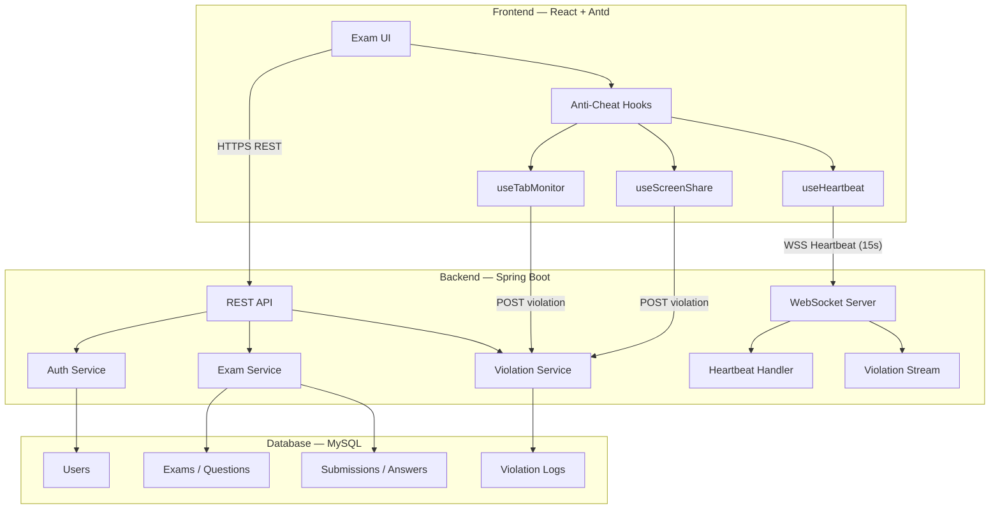
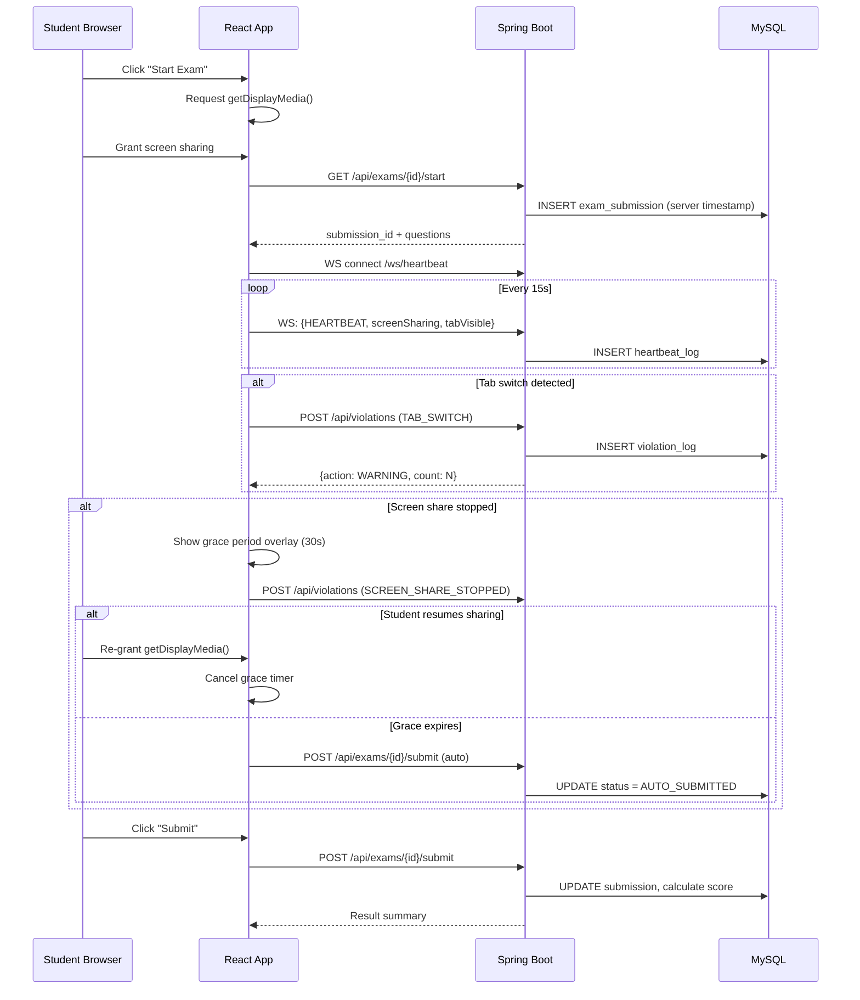

# Secure Exam Platform — Technical Specification

## 1. System Architecture Overview



### Data Flow — Anti-Cheat Heartbeat

1. **Exam Start** → Frontend initiates WebSocket + requests `getDisplayMedia`.
2. **During Exam** → Client sends heartbeat every **15 seconds** via WebSocket.
3. **Violation Detected** → Client sends REST `POST /api/violations` immediately.
4. **Server Validation** → Backend cross-checks heartbeat gaps, logs violations, and enforces lockout rules.
5. **Exam End** → Frontend submits answers; backend validates server-side timer.

---

## 2. Database Schema (MySQL)

### 2.1 `users`

```sql
CREATE TABLE users (
    id              BIGINT AUTO_INCREMENT PRIMARY KEY,
    email           VARCHAR(255) NOT NULL UNIQUE,
    password_hash   VARCHAR(255) NOT NULL,
    full_name       VARCHAR(255) NOT NULL,
    role            ENUM('STUDENT','TEACHER','ADMIN') NOT NULL DEFAULT 'STUDENT',
    created_at      TIMESTAMP DEFAULT CURRENT_TIMESTAMP,
    updated_at      TIMESTAMP DEFAULT CURRENT_TIMESTAMP ON UPDATE CURRENT_TIMESTAMP,
    INDEX idx_email (email)
);
```

### 2.2 `exams`

```sql
CREATE TABLE exams (
    id                  BIGINT AUTO_INCREMENT PRIMARY KEY,
    title               VARCHAR(500) NOT NULL,
    description         TEXT,
    created_by          BIGINT NOT NULL,
    duration_minutes    INT NOT NULL,
    start_time          DATETIME NOT NULL,
    end_time            DATETIME NOT NULL,
    max_tab_violations  INT DEFAULT 3,
    screen_share_required BOOLEAN DEFAULT TRUE,
    grace_period_seconds  INT DEFAULT 30,
    is_published        BOOLEAN DEFAULT FALSE,
    created_at          TIMESTAMP DEFAULT CURRENT_TIMESTAMP,
    updated_at          TIMESTAMP DEFAULT CURRENT_TIMESTAMP ON UPDATE CURRENT_TIMESTAMP,
    FOREIGN KEY (created_by) REFERENCES users(id),
    INDEX idx_start (start_time)
);
```

### 2.3 `questions`

```sql
CREATE TABLE questions (
    id              BIGINT AUTO_INCREMENT PRIMARY KEY,
    exam_id         BIGINT NOT NULL,
    question_text   TEXT NOT NULL,
    question_type   ENUM('MCQ','SHORT_ANSWER','ESSAY') NOT NULL,
    points          INT DEFAULT 1,
    sort_order      INT DEFAULT 0,
    FOREIGN KEY (exam_id) REFERENCES exams(id) ON DELETE CASCADE,
    INDEX idx_exam (exam_id)
);
```

### 2.4 `question_options`

```sql
CREATE TABLE question_options (
    id              BIGINT AUTO_INCREMENT PRIMARY KEY,
    question_id     BIGINT NOT NULL,
    option_text     TEXT NOT NULL,
    is_correct      BOOLEAN DEFAULT FALSE,
    sort_order      INT DEFAULT 0,
    FOREIGN KEY (question_id) REFERENCES questions(id) ON DELETE CASCADE
);
```

### 2.5 `exam_submissions`

```sql
CREATE TABLE exam_submissions (
    id              BIGINT AUTO_INCREMENT PRIMARY KEY,
    exam_id         BIGINT NOT NULL,
    user_id         BIGINT NOT NULL,
    status          ENUM('IN_PROGRESS','SUBMITTED','AUTO_SUBMITTED','LOCKED') NOT NULL,
    started_at      DATETIME NOT NULL,
    submitted_at    DATETIME,
    score           DECIMAL(5,2),
    ip_address      VARCHAR(45),
    user_agent      VARCHAR(500),
    created_at      TIMESTAMP DEFAULT CURRENT_TIMESTAMP,
    FOREIGN KEY (exam_id) REFERENCES exams(id),
    FOREIGN KEY (user_id) REFERENCES users(id),
    UNIQUE KEY uk_exam_user (exam_id, user_id)
);
```

### 2.6 `student_answers`

```sql
CREATE TABLE student_answers (
    id                  BIGINT AUTO_INCREMENT PRIMARY KEY,
    submission_id       BIGINT NOT NULL,
    question_id         BIGINT NOT NULL,
    selected_option_id  BIGINT,
    answer_text         TEXT,
    answered_at         TIMESTAMP DEFAULT CURRENT_TIMESTAMP,
    FOREIGN KEY (submission_id) REFERENCES exam_submissions(id),
    FOREIGN KEY (question_id) REFERENCES questions(id),
    FOREIGN KEY (selected_option_id) REFERENCES question_options(id),
    UNIQUE KEY uk_sub_question (submission_id, question_id)
);
```

### 2.7 `violation_logs`

```sql
CREATE TABLE violation_logs (
    id              BIGINT AUTO_INCREMENT PRIMARY KEY,
    submission_id   BIGINT NOT NULL,
    user_id         BIGINT NOT NULL,
    violation_type  ENUM('TAB_SWITCH','TAB_HIDDEN','SCREEN_SHARE_STOPPED',
                         'HEARTBEAT_MISS','DEVTOOLS_OPEN','COPY_PASTE',
                         'RIGHT_CLICK','FULLSCREEN_EXIT') NOT NULL,
    severity        ENUM('LOW','MEDIUM','HIGH','CRITICAL') NOT NULL,
    details         JSON,
    client_timestamp DATETIME NOT NULL,
    server_timestamp TIMESTAMP DEFAULT CURRENT_TIMESTAMP,
    FOREIGN KEY (submission_id) REFERENCES exam_submissions(id),
    FOREIGN KEY (user_id) REFERENCES users(id),
    INDEX idx_sub (submission_id),
    INDEX idx_user_time (user_id, server_timestamp)
);
```

### 2.8 `heartbeat_logs`

```sql
CREATE TABLE heartbeat_logs (
    id              BIGINT AUTO_INCREMENT PRIMARY KEY,
    submission_id   BIGINT NOT NULL,
    received_at     TIMESTAMP DEFAULT CURRENT_TIMESTAMP,
    screen_sharing  BOOLEAN NOT NULL,
    tab_visible     BOOLEAN NOT NULL,
    FOREIGN KEY (submission_id) REFERENCES exam_submissions(id),
    INDEX idx_sub_time (submission_id, received_at)
);
```

---

## 3. Project Folder Structures

### 3.1 Frontend (React + Antd + Vite)

```
exam-protector-frontend/
├── public/
├── src/
│   ├── api/                  # Axios instance, API functions
│   │   ├── axiosClient.js
│   │   ├── authApi.js
│   │   ├── examApi.js
│   │   └── violationApi.js
│   ├── components/           # Shared UI components
│   │   ├── AppLayout.jsx
│   │   ├── ProtectedRoute.jsx
│   │   └── CountdownTimer.jsx
│   ├── features/
│   │   ├── auth/
│   │   │   ├── LoginPage.jsx
│   │   │   └── RegisterPage.jsx
│   │   ├── dashboard/
│   │   │   ├── TeacherDashboard.jsx
│   │   │   └── StudentDashboard.jsx
│   │   ├── exam-management/
│   │   │   ├── ExamForm.jsx
│   │   │   ├── ExamList.jsx
│   │   │   └── QuestionEditor.jsx
│   │   ├── exam-session/       # ← The core anti-cheat area
│   │   │   ├── ExamSessionPage.jsx
│   │   │   ├── ScreenShareGate.jsx
│   │   │   ├── ViolationWarningModal.jsx
│   │   │   └── GracePeriodOverlay.jsx
│   │   └── results/
│   │       ├── ResultsPage.jsx
│   │       └── ViolationReport.jsx
│   ├── hooks/                # Anti-cheat hooks
│   │   ├── useTabMonitor.js
│   │   ├── useScreenShare.js
│   │   ├── useHeartbeat.js
│   │   ├── useDevToolsDetect.js
│   │   └── useAutoSave.js
│   ├── store/                # Zustand or Context
│   │   ├── authStore.js
│   │   └── examStore.js
│   ├── utils/
│   │   ├── constants.js
│   │   └── helpers.js
│   ├── App.jsx
│   └── main.jsx
├── package.json
└── vite.config.js
```

### 3.2 Backend (Spring Boot)

```
exam-protector-backend/
└── src/main/java/com/westride/examprotector/
    ├── config/
    │   ├── SecurityConfig.java
    │   ├── CorsConfig.java
    │   └── WebSocketConfig.java
    ├── controller/
    │   ├── AuthController.java
    │   ├── ExamController.java
    │   ├── QuestionController.java
    │   ├── SubmissionController.java
    │   └── ViolationController.java
    ├── dto/
    │   ├── request/
    │   │   ├── LoginRequest.java
    │   │   ├── ExamRequest.java
    │   │   └── ViolationRequest.java
    │   └── response/
    │       ├── AuthResponse.java
    │       ├── ExamResponse.java
    │       └── ApiResponse.java
    ├── entity/
    │   ├── User.java
    │   ├── Exam.java
    │   ├── Question.java
    │   ├── QuestionOption.java
    │   ├── ExamSubmission.java
    │   ├── StudentAnswer.java
    │   ├── ViolationLog.java
    │   └── HeartbeatLog.java
    ├── enums/
    │   ├── Role.java
    │   ├── ViolationType.java
    │   └── SubmissionStatus.java
    ├── exception/
    │   └── GlobalExceptionHandler.java
    ├── repository/
    │   ├── UserRepository.java
    │   ├── ExamRepository.java
    │   └── ViolationLogRepository.java
    ├── security/
    │   ├── JwtProvider.java
    │   ├── JwtAuthFilter.java
    │   └── UserDetailsServiceImpl.java
    ├── service/
    │   ├── AuthService.java
    │   ├── ExamService.java
    │   ├── SubmissionService.java
    │   └── ViolationService.java
    ├── websocket/
    │   ├── HeartbeatHandler.java
    │   └── ExamSessionHandler.java
    └── ExamProtectorApplication.java
```

---

## 4. Key API Endpoints

| Method | Endpoint | Auth | Description |
|--------|----------|------|-------------|
| POST | `/api/auth/register` | None | Register new user |
| POST | `/api/auth/login` | None | Login, returns JWT |
| GET | `/api/exams` | TEACHER/ADMIN | List exams |
| POST | `/api/exams` | TEACHER | Create exam |
| PUT | `/api/exams/{id}` | TEACHER | Update exam |
| DELETE | `/api/exams/{id}` | TEACHER | Delete exam |
| POST | `/api/exams/{id}/questions` | TEACHER | Add questions |
| GET | `/api/exams/{id}/start` | STUDENT | Start exam session |
| POST | `/api/exams/{id}/submit` | STUDENT | Submit exam |
| PUT | `/api/submissions/{id}/answers` | STUDENT | Auto-save answers |
| POST | `/api/violations` | STUDENT | Report a violation |
| GET | `/api/violations/{submissionId}` | TEACHER | View violation log |
| WS | `/ws/heartbeat` | JWT | Heartbeat channel |

---

## 5. Anti-Cheat Implementation Strategy

### 5.1 Tab-Switching Detection — `useTabMonitor.js`

```javascript
import { useEffect, useRef, useCallback } from 'react';
import { violationApi } from '../api/violationApi';

export function useTabMonitor(submissionId, maxViolations, onLockout) {
  const countRef = useRef(0);

  const reportViolation = useCallback(async (type) => {
    countRef.current += 1;
    await violationApi.report({
      submissionId,
      violationType: type,
      severity: countRef.current >= maxViolations ? 'CRITICAL' : 'MEDIUM',
      clientTimestamp: new Date().toISOString(),
      details: { count: countRef.current, max: maxViolations },
    });
    if (countRef.current >= maxViolations) onLockout();
  }, [submissionId, maxViolations, onLockout]);

  useEffect(() => {
    // 1) visibilitychange — detects tab switch / minimize
    const onVisChange = () => {
      if (document.visibilityState === 'hidden') {
        reportViolation('TAB_HIDDEN');
      }
    };

    // 2) blur — detects focus loss to other apps
    const onBlur = () => reportViolation('TAB_SWITCH');

    // 3) Block copy/paste & right-click
    const block = (e) => { e.preventDefault(); return false; };

    document.addEventListener('visibilitychange', onVisChange);
    window.addEventListener('blur', onBlur);
    document.addEventListener('copy', block);
    document.addEventListener('paste', block);
    document.addEventListener('contextmenu', block);

    return () => {
      document.removeEventListener('visibilitychange', onVisChange);
      window.removeEventListener('blur', onBlur);
      document.removeEventListener('copy', block);
      document.removeEventListener('paste', block);
      document.removeEventListener('contextmenu', block);
    };
  }, [reportViolation]);

  return { violationCount: countRef.current };
}
```

### 5.2 Screen Share Monitor — `useScreenShare.js`

```javascript
import { useState, useRef, useCallback, useEffect } from 'react';
import { violationApi } from '../api/violationApi';

export function useScreenShare(submissionId, gracePeriodSec, onGraceExpired) {
  const [status, setStatus] = useState('IDLE'); // IDLE | ACTIVE | GRACE | EXPIRED
  const [graceRemaining, setGraceRemaining] = useState(gracePeriodSec);
  const streamRef = useRef(null);
  const timerRef = useRef(null);
  const countdownRef = useRef(null);

  // Start screen sharing
  const startSharing = useCallback(async () => {
    try {
      const stream = await navigator.mediaDevices.getDisplayMedia({
        video: { displaySurface: 'monitor' }, // prefer entire screen
        audio: false,
      });
      streamRef.current = stream;
      const track = stream.getVideoTracks()[0];

      // Detect when user stops sharing
      track.onended = () => {
        setStatus('GRACE');
        setGraceRemaining(gracePeriodSec);

        violationApi.report({
          submissionId,
          violationType: 'SCREEN_SHARE_STOPPED',
          severity: 'HIGH',
          clientTimestamp: new Date().toISOString(),
        });

        // Start grace period countdown
        let remaining = gracePeriodSec;
        countdownRef.current = setInterval(() => {
          remaining -= 1;
          setGraceRemaining(remaining);
          if (remaining <= 0) {
            clearInterval(countdownRef.current);
            setStatus('EXPIRED');
            onGraceExpired(); // auto-submit or lock
          }
        }, 1000);
      };

      setStatus('ACTIVE');
      return true;
    } catch (err) {
      console.error('Screen share denied:', err);
      setStatus('IDLE');
      return false;
    }
  }, [submissionId, gracePeriodSec, onGraceExpired]);

  // Resume sharing (during grace period)
  const resumeSharing = useCallback(async () => {
    clearInterval(countdownRef.current);
    const ok = await startSharing();
    if (ok) {
      setGraceRemaining(gracePeriodSec);
    }
    return ok;
  }, [startSharing, gracePeriodSec]);

  // Cleanup
  useEffect(() => {
    return () => {
      clearInterval(countdownRef.current);
      streamRef.current?.getTracks().forEach((t) => t.stop());
    };
  }, []);

  return { status, graceRemaining, startSharing, resumeSharing };
}
```

### 5.3 Heartbeat Hook — `useHeartbeat.js`

```javascript
import { useEffect, useRef } from 'react';

export function useHeartbeat(submissionId, token, intervalMs = 15000) {
  const wsRef = useRef(null);

  useEffect(() => {
    const ws = new WebSocket(
      `wss://${location.host}/ws/heartbeat?token=${token}`
    );
    wsRef.current = ws;

    ws.onopen = () => {
      // Send heartbeat on interval
      const id = setInterval(() => {
        if (ws.readyState === WebSocket.OPEN) {
          ws.send(JSON.stringify({
            type: 'HEARTBEAT',
            submissionId,
            screenSharing: document.querySelector('video')?.srcObject?.active ?? false,
            tabVisible: document.visibilityState === 'visible',
            timestamp: Date.now(),
          }));
        }
      }, intervalMs);

      ws.onclose = () => clearInterval(id);
    };

    return () => ws.close();
  }, [submissionId, token, intervalMs]);
}
```

---

## 6. Backend Anti-Cheat Logic

### 6.1 Server-Side Timer Enforcement

```java
@Service
public class SubmissionService {

    public ExamSubmission startExam(Long examId, Long userId) {
        Exam exam = examRepo.findById(examId).orElseThrow();

        // Enforce server-side window
        Instant now = Instant.now();
        if (now.isBefore(exam.getStartTime().toInstant())
            || now.isAfter(exam.getEndTime().toInstant())) {
            throw new ExamNotAvailableException("Outside exam window");
        }

        ExamSubmission sub = new ExamSubmission();
        sub.setExamId(examId);
        sub.setUserId(userId);
        sub.setStartedAt(LocalDateTime.now());  // SERVER timestamp
        sub.setStatus(SubmissionStatus.IN_PROGRESS);
        return submissionRepo.save(sub);
    }

    public void submitExam(Long submissionId) {
        ExamSubmission sub = submissionRepo.findById(submissionId).orElseThrow();
        Exam exam = examRepo.findById(sub.getExamId()).orElseThrow();

        // Auto-grade MCQs
        sub.setSubmittedAt(LocalDateTime.now());
        sub.setStatus(SubmissionStatus.SUBMITTED);
        sub.setScore(calculateScore(sub));
        submissionRepo.save(sub);
    }

    // Called by scheduler — auto-submit expired exams
    @Scheduled(fixedRate = 30000)
    public void autoSubmitExpired() {
        List<ExamSubmission> active = submissionRepo
            .findByStatus(SubmissionStatus.IN_PROGRESS);
        for (ExamSubmission sub : active) {
            Exam exam = examRepo.findById(sub.getExamId()).orElseThrow();
            long elapsed = Duration.between(sub.getStartedAt(),
                                            LocalDateTime.now()).toMinutes();
            if (elapsed >= exam.getDurationMinutes()) {
                sub.setStatus(SubmissionStatus.AUTO_SUBMITTED);
                sub.setSubmittedAt(LocalDateTime.now());
                submissionRepo.save(sub);
            }
        }
    }
}
```

### 6.2 Violation Logging (Tamper-Resistant)

```java
@RestController
@RequestMapping("/api/violations")
public class ViolationController {

    @PostMapping
    public ResponseEntity<?> reportViolation(
            @Valid @RequestBody ViolationRequest req,
            @AuthenticationPrincipal UserDetails user) {

        // 1. Verify submission belongs to this user
        ExamSubmission sub = submissionRepo.findById(req.getSubmissionId())
            .orElseThrow();
        if (!sub.getUserId().equals(getUserId(user))) {
            throw new AccessDeniedException("Not your submission");
        }

        // 2. Log with SERVER timestamp (client timestamp stored for audit)
        ViolationLog log = new ViolationLog();
        log.setSubmissionId(req.getSubmissionId());
        log.setUserId(getUserId(user));
        log.setViolationType(req.getViolationType());
        log.setSeverity(req.getSeverity());
        log.setDetails(req.getDetails());
        log.setClientTimestamp(req.getClientTimestamp());
        // server_timestamp auto-set by DB
        violationRepo.save(log);

        // 3. Check lockout threshold
        long count = violationRepo.countBySubmissionId(req.getSubmissionId());
        Exam exam = examRepo.findById(sub.getExamId()).orElseThrow();
        if (count >= exam.getMaxTabViolations()) {
            sub.setStatus(SubmissionStatus.LOCKED);
            submissionRepo.save(sub);
            return ResponseEntity.ok(Map.of("action", "LOCKED"));
        }

        return ResponseEntity.ok(Map.of("action", "WARNING", "count", count));
    }
}
```

### 6.3 WebSocket Heartbeat Handler

```java
@Component
public class HeartbeatHandler extends TextWebSocketHandler {

    private final HeartbeatLogRepository heartbeatRepo;
    // Map<submissionId, lastHeartbeatTime>
    private final ConcurrentHashMap<Long, Instant> lastSeen = new ConcurrentHashMap<>();

    @Override
    protected void handleTextMessage(WebSocketSession session, TextMessage msg) {
        HeartbeatPayload payload = objectMapper.readValue(msg.getPayload(),
                                                          HeartbeatPayload.class);
        lastSeen.put(payload.getSubmissionId(), Instant.now());

        HeartbeatLog log = new HeartbeatLog();
        log.setSubmissionId(payload.getSubmissionId());
        log.setScreenSharing(payload.isScreenSharing());
        log.setTabVisible(payload.isTabVisible());
        heartbeatRepo.save(log);
    }

    // Scheduled task: detect missed heartbeats
    @Scheduled(fixedRate = 20000)
    public void detectMissedHeartbeats() {
        Instant threshold = Instant.now().minusSeconds(45);
        lastSeen.forEach((subId, lastTime) -> {
            if (lastTime.isBefore(threshold)) {
                violationService.logServerViolation(subId,
                    ViolationType.HEARTBEAT_MISS, "No heartbeat for 45s+");
            }
        });
    }
}
```

---

## 7. Security Hardening

### 7.1 Preventing Bypass Techniques

| Threat | Mitigation |
|--------|-----------|
| **Browser extensions intercepting events** | Server-side heartbeat validation — if client stops sending, server detects it regardless of client-side tampering |
| **DevTools open to modify JS** | `useDevToolsDetect` hook (measures `debugger` statement timing + `window.outerWidth - window.innerWidth` threshold); report as violation |
| **API tampering (fake submissions)** | All timers enforced server-side; JWT + ownership validation on every endpoint; `submittedAt` is always server timestamp |
| **Replay attacks** | Short-lived JWTs (15 min) + nonce in heartbeat payloads |
| **Multiple tabs** | Backend rejects a second `startExam` call for the same `(exam_id, user_id)` pair via UNIQUE constraint |
| **Virtual machines / remote desktop** | Pre-exam environment check (detect `navigator.userAgent` anomalies, `window.screen` resolution mismatches); flag for manual review |
| **Copy-paste & right-click** | Blocked via event listeners + CSS `user-select: none`; logged if triggered |

### 7.2 DevTools Detection Hook (Sketch)

```javascript
export function useDevToolsDetect(onDetected) {
  useEffect(() => {
    const threshold = 160;
    const check = () => {
      const widthDiff = window.outerWidth - window.innerWidth > threshold;
      const heightDiff = window.outerHeight - window.innerHeight > threshold;
      if (widthDiff || heightDiff) onDetected();
    };
    const id = setInterval(check, 1000);

    // debugger timing trick
    const img = new Image();
    Object.defineProperty(img, 'id', {
      get: () => { onDetected(); }
    });
    // console.log('%c', img); // triggers getter if devtools console is open

    return () => clearInterval(id);
  }, [onDetected]);
}
```

---

## 8. Exam Session Flow (Sequence)



---

## 9. Verification Plan

### Automated Tests
- **Backend**: JUnit 5 + MockMvc for all controller endpoints; verify timer enforcement and violation thresholds.
- **Frontend**: React Testing Library for hook behavior (mock `getDisplayMedia`, `visibilitychange`).
- **Integration**: Testcontainers with MySQL for full API flow.

### Manual Verification
- Test tab-switching in Chrome, Firefox, Edge — verify violation logs appear.
- Test screen share start/stop/grace-period flow end-to-end.
- Attempt DevTools bypass — verify server-side heartbeat catches missed beats.
- Load test WebSocket with 100+ concurrent connections.

---

## Open Questions

> [!IMPORTANT]
> 1. **Authentication scope**: Use email/password with JWT for the initial version; OAuth2/SSO can be added later as an extension.
> 2. **Webcam proctoring**: Not required for MVP; screen‑sharing + tab‑monitoring is sufficient. Webcam capture can be introduced in a future phase.
> 3. **Deployment target**: Develop and test locally with Docker Compose; production will be containerized on AWS (ECS/Fargate) with optional GCP Cloud Run support.
> 4. **Question types**: Support MCQ, short answer, and essay in v1. File‑upload question type will be deferred to a later release.

## 10. Implementation Timeline

| Phase | Duration | Key Deliverables |
|-------|----------|------------------|
| Phase 1: Core Backend & DB | 2 weeks | Entities, Repositories, Auth, Exam Service, Submission Service, Violation Service |
| Phase 2: Frontend Foundations | 1 week | Vite setup, Ant Design theme, API client, routing |
| Phase 3: Anti‑Cheat Hooks | 2 weeks | `useTabMonitor`, `useScreenShare`, `useHeartbeat`, `useDevToolsDetect` |
| Phase 4: UI Pages & Integration | 2 weeks | Auth pages, Dashboard, Exam creation, Exam session, Results |
| Phase 5: Testing & Hardening | 1 week | Automated tests, integration tests, security review |
| Phase 6: Deployment & Monitoring | 1 week | Docker Compose, CI/CD pipeline, performance testing |

## 11. Future Enhancements

- Webcam proctoring with WebRTC streams.
- AI‑based answer plagiarism detection.
- Support for file‑upload question types.
- Multi‑language localization.
- Admin analytics dashboard.

## 12. Acceptance Criteria

- All API endpoints conform to OpenAPI spec and are secured with JWT.
- Anti‑cheat hooks detect and log violations with >95% accuracy in manual test suite.
- Exams automatically lock after exceeding `max_tab_violations`.
- Grace period timer works correctly on screen‑share stop.
- End‑to‑end flow passes integration tests with Testcontainers.
- Deployment script launches both frontend and backend with a single `docker-compose up`.
## 13. Risks & Mitigations

- **Performance under load**: WebSocket connections may strain server resources. Mitigation: enable connection pooling, configure max connections, and conduct load testing.
- **Cheat detection evasion**: Advanced users might bypass client-side hooks. Mitigation: server‑side heartbeat validation and tamper‑resistant logging.
- **Data privacy**: Violation logs contain timestamps and potentially user behavior data. Mitigation: encrypt logs at rest and enforce strict access controls.
- **Deployment complexity**: Multi‑container setup may cause configuration drift. Mitigation: use Docker Compose with version‑controlled environment files.

## 14. Appendix

- **Architecture diagram**: 
- **API specification**: OpenAPI 3.0 document located at `backend/openapi.yaml`.
- **Sequence diagrams**: See `docs/sequence_diagrams.md` for detailed flow charts.

## 15. Glossary

- **JWT**: JSON Web Token, used for stateless authentication.
- **WebSocket**: Persistent bi‑directional communication channel.
- **Heartbeat**: Periodic signal sent from client to server to confirm active session.
- **Grace period**: Time allowed for the student to resume screen sharing after interruption.
- **Violation**: Any detected cheating behavior, logged for review.

